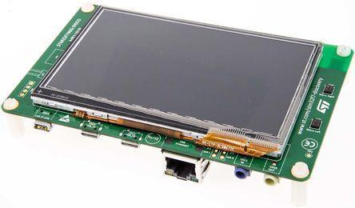

..
    Copyright 2020-2021 MicroEJ Corp. All rights reserved.
    This library is provided in source code for use, modification and test, subject to license terms.
    Any modification of the source code will break MicroEJ Corp. warranties on the whole library.

.. |BOARD_NAME| replace:: STM32F746G discovery
.. |BOARD_REVISION| replace:: A01
.. |PLATFORM_NAME| replace:: STM32F746G Platform
.. |PLATFORM_VER| replace:: 0.1.0
.. |RCP| replace:: MICROEJ SDK
.. |PLATFORM| replace:: MicroEJ Platform
.. |PLATFORMS| replace:: MicroEJ Platforms
.. |SIM| replace:: MicroEJ Simulator
.. |ARCH| replace:: MicroEJ Architecture
.. |CIDE| replace:: MICROEJ SDK
.. |RTOS| replace:: Zephyr RTOS
.. |MANUFACTURER| replace:: STMicroelectronics

.. _README MicroEJ BSP: ./stm32f746g_zephyr-bsp/projects/microej/README.rst
.. _RELEASE NOTES: ./RELEASE_NOTES.rst
.. _CHANGELOG: ./CHANGELOG.rst

==========================================
|PLATFORM| for |MANUFACTURER| |BOARD_NAME|
==========================================

This project is used to build a |PLATFORM| for the |BOARD_NAME|
development board.

It is recommended to read this tutorial before using the platform: https://docs.microej.com/en/latest/Tutorials/tutorialUnderstandMicroEJFirmwareBuild.html.

Related Files
=============

This directory also contains:

* `CHANGELOG`_ to track the changes in the MicroEJ
  |BOARD_NAME| Platform.
* `RELEASE NOTES`_ to list:

  - the supported hardware,
  - the known issues and the limitations,
  - the development environment,
  - the list of the dependencies and their versions.

* `README MicroEJ BSP`_ to customize the build/flash process.
  
Board Technical Specifications
==============================

.. list-table::

   * - Name
     - |BOARD_NAME|
   * - Revision
     - |BOARD_REVISION|
   * - MCU part number
     - STM32F746NG
   * - MCU revision
     - N/A
   * - MCU architecture
     - ARM Cortex-M7
   * - MCU max clock frequency
     - 216 MHz
   * - Internal flash size
     - 1 MB
   * - Internal SRAM size
     - 340 KB
   * - External flash size
     - 16 MB
   * - External SRAM size
     - 16 MB
   * - Power supply
     - 5 different options for power supply

Here is a list of |BOARD_NAME| useful documentation links:

- Board documentation available `here <https://www.st.com/en/evaluation-tools/32f746gdiscovery.html>`__.
- Microcontroller documentation available `here <https://www.st.com/en/microcontrollers-microprocessors/stm32f746ng.html>`__.
- Zephyr board support documentation available `here <https://docs.zephyrproject.org/2.5.0/boards/arm/stm32f746g_disco/doc/index.html>`__.

Platform Specifications
=======================

The Architecture version is ``7.15.1``.

This Platform provides the following Foundation Libraries:

.. list-table::
   :header-rows: 1

   * - Foundation Library
     - Version
   * - BON
     - 1.4
   * - EDC
     - 1.3
   * - NLS
     - 2.0
   * - TRACE
     - 1.1

The |PLATFORM| is derived into:

- a Mono-Sandbox Platform (default),
- a Multi-Sandbox Platform.

Requirements
============

- PC with Windows 10 or Linux.
- Internet connection to `MicroEJ Central Repository <https://developer.microej.com/central-repository/>`_.
- |RCP| Dist. ``21.03`` or higher, available `here <https://developer.microej.com/get-started/>`_.
- |BOARD_NAME| board.

BSP Setup
=========

Install zephyr and the required third party utilities as described `here <https://docs.zephyrproject.org/2.5.0/getting_started/index.html>`_. 
The relevant sections to complete are:

1. Select and Update OS,
2. Install dependencies,
3. Get Zephyr and install Python dependencies (see note below),
4. Install a Toolchain.

.. note::
   Use command ``west init -m https://github.com/zephyrproject-rtos/zephyr --mr v2.5.0 zephyrproject``
   instead of ``west init`` to force use of Zephyr Project v2.5.0 in section ``3. Get Zephyr and install Python dependencies``.

The zephyr SDK is only available for Ubuntu Linux distribution. It contains all necessary tools to build Zephyr project on all supported architectures.
Additionally, it includes host tools such as custom QEMU binaries, host compiler, openocd, etc.

If the SDK is available for your Linux operating system, it should be installed as described
`here <https://docs.zephyrproject.org/2.5.0/getting_started/installation_linux.html#zephyr-sdk>`_.

Otherwise, the gnu arm compilation toolchain should additionally be installed, following the first step listed
`here <https://docs.zephyrproject.org/2.5.0/getting_started/toolchain_3rd_party_x_compilers.html#gnu-arm-embedded>`_.

The environment variables ``ZEPHYR_TOOLCHAIN_VARIANT`` and ``GNUARMEMB_TOOLCHAIN_PATH`` have to be correctly defined to build a project for the target.
See `README MicroEJ BSP`_ to learn how to do so.

``openocd`` is included in zephyr's SDK, Windows and macOS users will have to set it up manually to flash and debug the software. 
It can either be compiled from sources using the `patched openocd <https://github.com/zephyrproject-rtos/openocd>`_
for zephyr or it can be downloaded in `pre-built version <https://gnutoolchains.com/arm-eabi/openocd>`_. 

Follow the instructions under *BSP setup* in `README MicroEJ BSP`_ for further information.

BSP Compilation
---------------

The Platform provides a pre-compiled Mono-Sandbox Application.
Validate the BSP installation by compiling the BSP to build a MicroEJ
Firmware.

To build the ``stm32f746g_zephyr-bsp`` project, open a
terminal and enter the following command lines:

.. code-block:: sh

      $ cd "xxx/stm32f746g_zephyr-bsp/projects/microej/scripts"
      $ build.bat

The BSP project build is launched. Please wait for the final message:

.. code-block::

      build.bat script terminating.

Please refer to `README MicroEJ BSP`_ for more details on how to
customize the build scripts.

Board Setup
===========

Please refer to the |MANUFACTURER| documentation available `here
<https://www.st.com/en/evaluation-tools/32f746gdiscovery.html#documentation>`__
for more details.

Power Supply
------------

There are 5 different options for power supply:

- ST LINK/V2-1.
- USB FS connector.
- USB HS connector.
- VIN from Arduino connector.
- External 5V from connector.

Programming
-----------

Please Follow the steps below:

- Connect the USB ST-LINK connector of the board to your computer.
- Open a terminal and enter the following command lines:

.. code-block:: sh

      $ cd "xxx/stm32f746g_zephyr-bsp/projects/microej/scripts"
      $ run.bat

The firmware is launched. Please wait for the final message:

.. code-block::

      run.bat script terminating.

Logs Output
-----------

MicroEJ platform uses the virtual UART from the |BOARD_NAME|
USB port.  A COM port is automatically mounted when the board is
plugged to a computer using USB cable.  All board logs are available
through this COM port.

The COM port uses the following parameters:

.. list-table::
   :widths: 3 2

   * - Baudrate
     - 115200
   * - Data bits bits
     - 8
   * - Parity bits
     - None
   * - Stop bits
     - 1
   * - Flow control
     - None

If flashed, the pre-compiled application outputs ``Hello World``.

Debugging
---------

An embedded ST-LINK debugger is also directly available through the USB interface.

Please refer to the `README MicroEJ BSP`_ section debugging for more
details.

Platform Setup
==============

Platform Import
---------------

Import the projects in |RCP| Workspace:

- ``File`` > ``Import`` > ``Existing Projects into Workspace`` >
  ``Next``,
- Point ``Select root directory`` to where the project was cloned,
- Click ``Finish``.

Inside |RCP|, the selected example is imported as several projects
prefixed by the given name:

- ``stm32f746g_zephyr-configuration`` contains the
  platform configuration description. Some modules are described in a
  specific sub-folder / with some optional configuration files
  (``.properties`` and / or ``.xml``).

- ``stm32f746g_zephyr-bsp`` contains a ready-to-use BSP
  software project for the |BOARD_NAME| board, including a
  |CIDE| project, an implementation of MicroEJ core engine (and
  extensions) port on |RTOS| and the |BOARD_NAME| board
  support package.

- ``stm32f746g_zephyr-fp`` contains the board description and
  images for the MicroEJ Simulator. This project is updated once
  the platform is built.

- ``stm32f746g-Platform-CM7hardfp_GCC48-{version}``
  contains the |RCP| Platform project which is empty by default until
  the Platform is built.

Platform Build
--------------

To build the Platform, please follow the steps below:

- Right-click on ``stm32f746g_zephyr-configuration``
  project in your |RCP| workspace,
- Click on ``Build Module``.

The build starts.  This step may take several minutes.  The first
time, the Platform build requires to download modules that are
available on the MicroEJ Central Repository.  You can see the progress
of the build steps in the MicroEJ console.

Please wait for the final message:

.. code-block::

                          BUILD SUCCESSFUL

At the end of the execution the |PLATFORM| is fully built for the
|BOARD_NAME| board and is ready to be linked into the |CIDE|
project.

The Platform project should be refreshed with no error in the |RCP|
``stm32f746g-Platform-CM7hardfp_GCC48-{version}``.

Please refer to 
https://docs.microej.com/en/latest/ApplicationDeveloperGuide/standaloneApplication.html
for more information on how to build a MicroEJ Standalone Application.

An evaluation license is needed for building an application. Please refer to
https://docs.microej.com/en/latest/overview/licenses.html#evaluation-license
for information on how to acquire and activate a license.

Testsuite Configuration
=======================

Troubleshooting
===============

Files not found during the build
--------------------------------

Errors about files not found during the build may be caused by long
path.  Please refer to the known issues and limitations in the
`RELEASE NOTES`_ for a workaround.

Zephyr project build cache issue
--------------------------------

Zephyr project build issue can occurred if OS environment variables have been updated 
and an old Zephyr project build cache already exists. Please cleanup Zephyr project build 
cache and relaunch a build before investigating more on the issue.